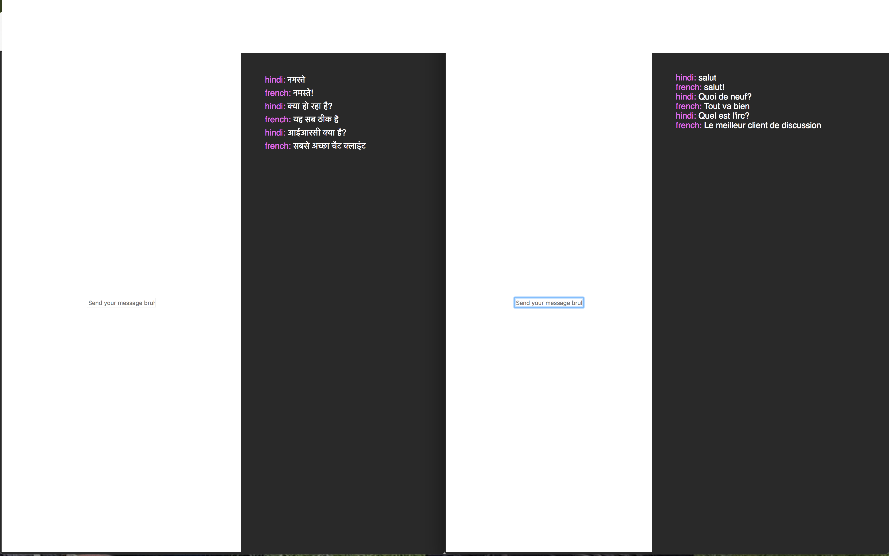

# Transalatory Half-way Experience over Internet Raj Chat

## THE IRC

A proof of concept chat client, which helps you cross the barriers between languages, made for the [Intervarsity-Hackathon-2017.](https://www.facebook.com/events/765152773640478/) in which the project won second place.

On selecting your nick and your language you can converse with anyone in your preferred language.

## Project Stack:

* Written completely in ES 2015 Javascript
* Front-end HTML/CSS
* Chat client written using Web Sockets :heart:

## TODOS:

* Users should be able to write in their own languages.

## Screenshot:

Left chose Hindi and right chose French.

Brought to you by Team TCDB4CB.
